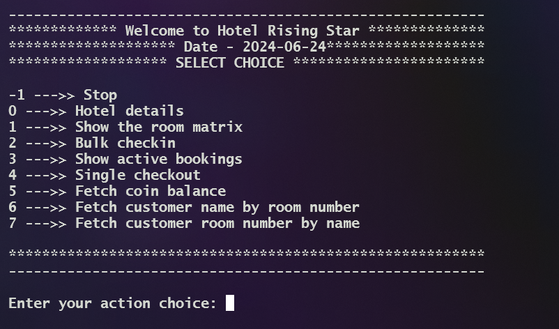
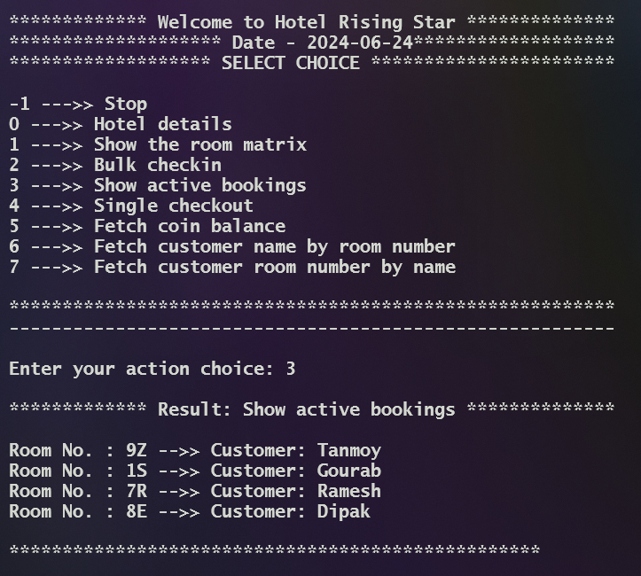

# Hotel Room Booking System

## Overview

This repository contains a Java-based console application designed to manage hotel room bookings. The hotel comprises 10 floors (numbered 0 to 9), with each floor containing 26 rooms (labeled from 'A' to 'Z'). The system allows a receptionist to handle booking queries, check-ins, and check-outs efficiently.

## Features

1. **Display Hotel Details**: View basic details about the hotel.
2. **Show Room Matrix**: Display a 2D matrix representing all hotel rooms.
3. **Bulk Check-In**: Check in multiple customers at once.
4. **Show Active Bookings**: Display all currently booked rooms with customer names.
5. **Customer Checkout**: Check out a customer by their name.
6. **Fetch Coin Balance**: Retrieve the total coins collected from bookings.
7. **Find Customer by Room Number**: Get customer name by providing a room number.
8. **Find Room Number by Customer Name**: Get room number by providing a customer name.

## Getting Started

### Prerequisites

- Java Development Kit (JDK) 8 or higher
- A Java IDE or a text editor with Java support
- Command line or terminal for running the program

### Installation

1. Clone the repository:
    ```sh
    git clone https://github.com/your-username/hotel-booking-system.git
    ```
2. Navigate to the project directory:
    ```sh
    cd hotel-booking-system
    ```

### Running the Application

1. Compile the Java files:
    ```sh
    javac Main.java Backend.java
    ```
2. Run the application:
    ```sh
    java Main
    ```

## Usage

### Main Menu

Upon running the application, the main menu displays various options for different actions:





### Booking and Checkout

- **Bulk Check-In**: Choose option `2`, and provide the number of customers and their details (name, preferred floor, and room name).
- **Customer Checkout**: Choose option `4`, and provide the customer's name to check out.

### Fetching Information

- **Show Room Matrix**: Choose option `1` to display the current state of all rooms.
- **Show Active Bookings**: Choose option `3` to display all active bookings.
- **Fetch Coin Balance**: Choose option `5` to see the total coins collected.
- **Find Customer by Room Number**: Choose option `6`, and enter the room number to get the customer name.
- **Find Room Number by Customer Name**: Choose option `7`, and enter the customer name to get the room number.



### Stopping the Application

- Choose option `-1` to stop the execution.

## Code Structure

- **Main.java**: Contains the main method, user interface logic, and handles user inputs.
- **Backend.java**: Contains methods for room management, bookings, checkouts, and information retrieval.

## Contributing

Contributions are welcome! Please fork this repository and create a pull request with your changes.


## Acknowledgments

- Thanks to the Java community for providing numerous resources and documentation.

## Contact

For any inquiries or issues, please open an issue on the GitHub repository. <br>
> **Note:** For more information, you can connect with me on [LinkedIn](www.linkedin.com/in/gourab-pal-0327801a4).


---

Happy booking!
